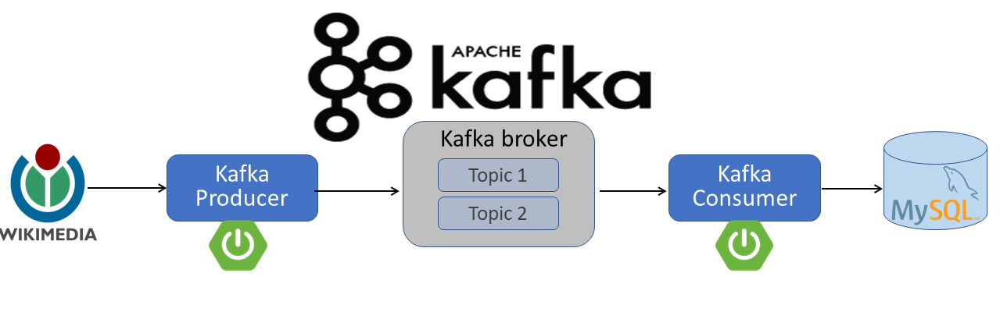

# Wikimedia real-time Stream to database(Springboot, Apache Kafka, Microservices, MySQL)

## Information

- <b> Apache Kafka </b> is an event streaming platform used to collect, process, store, and integrate data at scale. It has numerous use cases including distributed streaming, stream processing, data integration, and pub/sub messaging.
- A <b> broker </b> refers to a server in the <b> Kafka storage layer </b> that stores event streams from one or more sources. A <b> Kafka cluster </b> is typically comprised of several brokers. Every broker in a cluster is also a <b> bootstrap server </b>, meaning if you can connect to one broker in a cluster, you can connect to every broker.
- A <b> Topic </b> is a logical name to which the records are published. A <b> topic </b> is a log of events, similar to a folder in a filesystem, where events are the files in that folder.Topics are broken up into <b> partitions</b>, meaning a single topic log is broken into multiple logs located on different <b> Kafka brokers </b>.
- <b> Producers </b> are clients that write events to Kafka. The <b> producer </b> specifies the topics they will write to and the producer controls how events are assigned to <b> partitions </b> within a topic.
- <b> Consumers </b> are clients that read and process events from Kafka.

## About the Project

It is a Spring boot Apache Kafka real-time Project that have two microservices and used Kafka as a messaging system to exchange messages between microservices.

In this project, a <b> Kafka producer </b> created which read a real-time stream data from the wikipedia (https://stream.wikimedia.org/v2/stream/recentchange) 
and write the data to the <b> Kafka broker </b> 
and then created a <b> kafka consumer </b> which consume the real-time stream data from the <b> Kafka broker </b> and write to the <b> MySQL database </b>. 

## Screenshots

Click here to show the screenshots of project

  
 
 producer 

 
 
 consumer 

 
 
 MySQL database 

 
 

